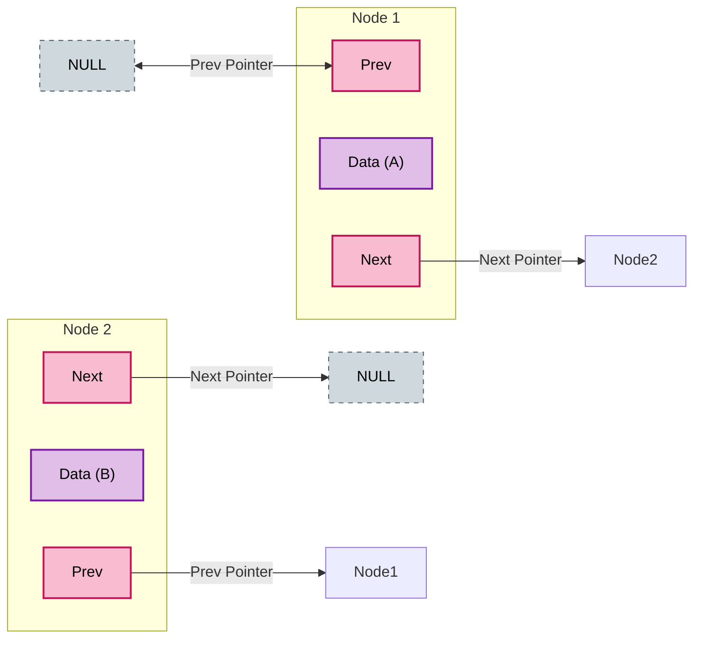

# C++ Data Structures

My personal implementations of core data structures from scratch in C++, built during the **Programming Advices** curriculum.

## 📚 Course
* [Data Structures Level 1](https://programmingadvices.com/p/12-data-structures-level1)

## 🛠 Technologies
* **C++**
* Pointers, Memory Management, and Classes

## 🚀 Implementations Included
* **Singly Linked List:** Custom `Node` classes with functions for `InsertAtBeginning`, `InsertAfter`, `DeleteNode`, etc.
* **Doubly Linked List:** Advanced node linking with `Prev` and `Next` pointers for bi-directional traversal.
* **Stacks & Queues:** Implementations demonstrating LIFO and FIFO behavior.
* **Map:** Basic key-value mapping concepts.

### 🧠 Memory Architecture (Doubly Linked List)

